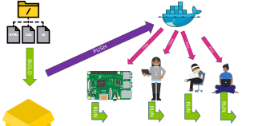
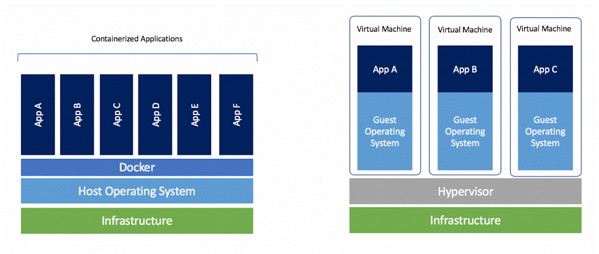
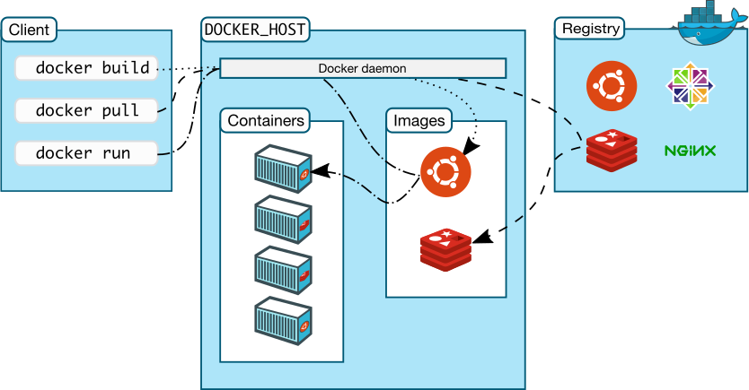
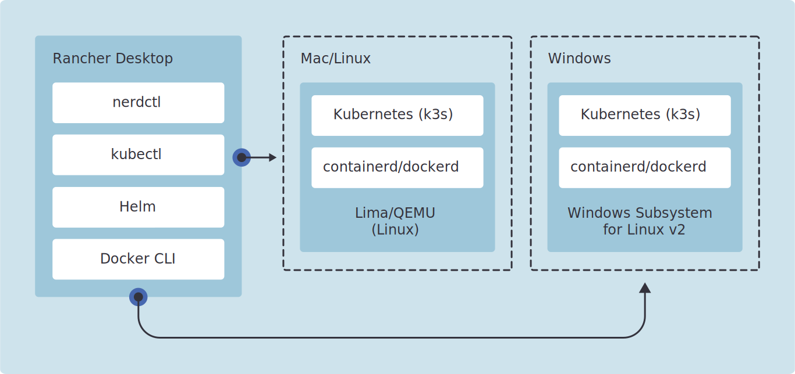
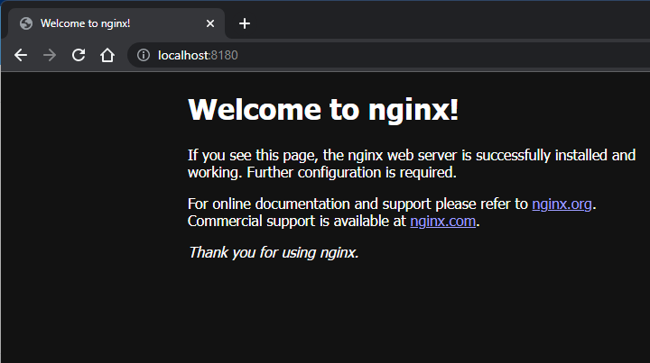
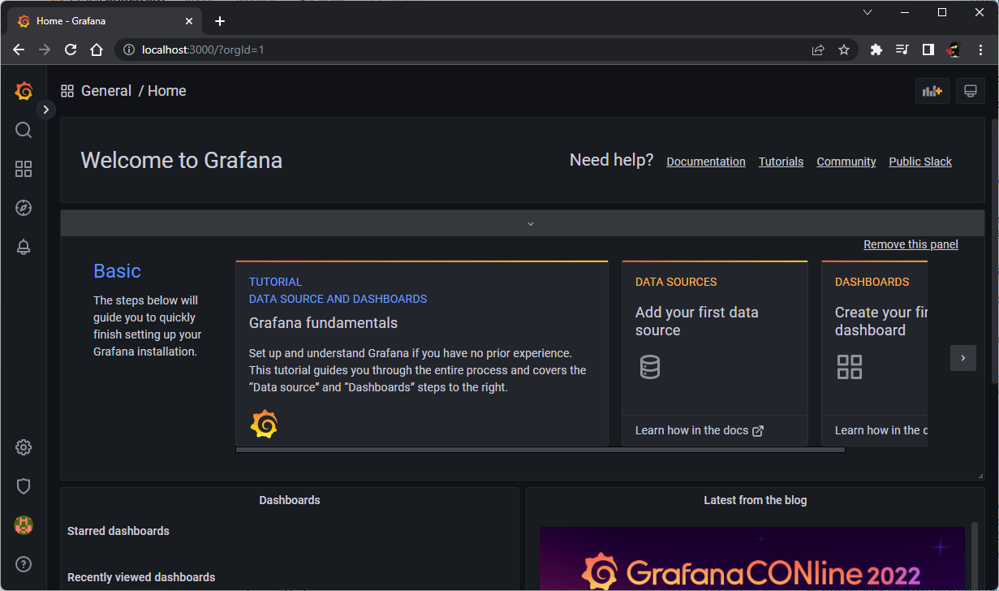



## INTRODUCCION

**La tecnología/plataforma de contenedores sirve para EMPAQUETAR, DISTRIBUIR E IMPLEMENTAR SOFTWARE** . Incluye todo lo necesario para ejecutarse, incluso su sistema operativo (en realidad una parte pero a fines prácticos es una descripción valida).

En el siguiente grafico vemos las tres etapas principales



### CONCEPTOS

<table>
  <tr>
    <td>
      
    </td>
    <td>
      <strong>IMAGEN</strong> <span>Set de archivos de solo lectura que sirve de plantilla para crear un CONTENEDOR. A menudo, una imagen se basa en otra imagen, con alguna personalización adicional.</span>
    </td>
  </tr>
  <tr>
    <td>
      
    </td>
    <td>
      <strong>REGISTRY</strong> <span> Repositorio de imagenes, puede ser publico o privado</span>
    </td>
  </tr>
  <tr>
    <td>
      
    </td>
    <td>
      <strong>CONTAINER</strong> <span> Es la implementación de una imagen o <b>instancia de una imagen</b>. Mediante el uso de parámetros determinados por la imagen se puede configurar.o</span>
    </td>
  </tr>
</table>

Los COMANDOS PRINCIPALES de Docker son los siguientes

- **BUILD**: Empaqueta los binarios y todas las librerías del software en una IMAGEN

- **PUSH**: publica la IMAGEN generada en el REGISTRY

- **PULL**: Obtiene una IMAGEN desde un REGISTRY

- **RUN**: Crea una instancia de una IMAGEN denominada CONTENEDOR

## CONTENEDORES VS VM

La tecnología de contenedores permite empaquetar,distribuir y ejecutar software con todo lo necesario para ejecutarse, incluso su sistema operativo.

Es una alternativa liviana a las maquinas virtuales dado que su nivel de abstracción no comienza desde el hardware sino que desde el sistema operativo.


## ARQUITECTURA DE DOCKER

Docker tiene los siguientes componentes PRINCIPALES



- `docker-host | Docker Engine | Docker` : Un servidor donde corre Docker encargado de ejecutar los comandos de coker como BUILD, PULL, PUSH y RUN
- `docker-cli`: interface de línea de comandos de Docker. En pocas palabras lo que usamos para enviar comandos al Docker Engine
- `docker-registry`: Registro publico o privado de imágenes, sirve para distribuir imágenes.

Docker es una tecnología  *Open Source* y con estándares, esto nos permite elegir entre un variado ecosistema de aplicaciones que entran dentro de estos tres roles.

## DOCKER EN PC LOCAL

Cada uno de los componentes de Docker tiene una API estándar y abierta lo que hace es que tengamos varias implementaciones. En mi maquina local yo tengo dos opciones

- [Docker Desktop](https://docs.docker.com/get-docker/): Es la opción por defecto que utiliza todo el mundo. Cuando lanzaron la opción paga puso algunas cosas como que era obligatorio actualizarlo a la ultima versión si estabas en la versión gratuita y me pase a Rancher. Como aumentaron mucho las quejas terminaron sacando esas "molestias" de Docker Desktop

- [Rancher Desktop](https://rancherdesktop.io/): Es una alternativa a Docker Desktop.  PEEEERO para utilizar el Docker CLI tiene que cambiar el `Container Runtime` a `dockerd(moby)` . La alternativa `containerd` usa `nerdctl`, que tiene exactamente los mismos argumentos que Docker (y algunos mas) pero no integra bien con vscode :S y los devcontainers.


**USUARIOS DE WINDOWS IMPORTANTE:** Van a necesitar habilitar en su Windows el [WSL](https://docs.microsoft.com/en-us/windows/wsl/install). Básicamente es un Kernel de Linux dentro de Windows. Tanto Docker Desktop como Rancher Desktop interactúan con el Kernel de Linux.



## INSTANCIANDO UN CONTENEDOR

Hacemos una practica rápida con imágenes PRE EXISTENTES. ¿De donde salen las imágenes pre existentes que vamos a usar?  del hub.docker.com que es el registro de imágenes de Docker por defecto.

Creemos un contenedor a partir de la imagen correspondiente a la ultima versión de NGINX `nginx:latest` (nginx es un servidor web liviano muy utilizado)

```bash
docker run --name soy-un-nginx -p 8180:80 -d nginx:latest
```

Vamos de atrás para adelante

- `nginx:latest` es la imagen a utilizar `:latest` es un tag que indica USAR LA ULTIMA VERSION de NGINX
- `--name soy-un-nginx` especifica el nombre del contenedor creado basado en la imagen NGINX
- `-d` ejecutar el contenedor en modo datached. Es decir que el contenedor continua ejecutandose en background, aun que cerremos la ventana de consola.
- `-p 8080:80` esta opcion le dice a Docker que conecte el puerto 8180 del la PC host de Docker con el puerto 80 del contenedor. El puerto 80 es expuesto por la imagen de NGINX (por que es un servidor web y el puerto 80 es el puerto por defecto).

Verificamos que este corriendo con `docker ps` que lista todos los contenedores en ejecucion

```bash
$ docker ps
CONTAINER ID   IMAGE  ...         PORTS                                   NAMES
cfa9a43f7c70   nginx  ...         0.0.0.0:8180->80/tcp, :::8180->80/tcp   soy-un-nginx
```

También podemos navegar a la URL <http://localhost:8180>



Ahora nos toca hacer un poco de limpieza deteniendo y eliminado el contenedor utilizando CONTAINER ID

```bash
$ docker stop cfa9a43f7c70
$ docker rm cfa9a43f7c70
```

Emocionante? no? ... ok no vamos a ejecutar algo un poquito mas rimbombante. Grafana es un software de visualizacion que se conecta a bases de datos no relacionales como infludd, elasticsearch o prometheus. ¿No las conocen? ya las van a conocer

```bash
docker run  -p 3000:3000 -d --name=grafana grafana/grafana:latest
```

Nuevamente vamos de atras para adelante

- `grafana/grafana` es la imagen a utilizar tiene el prefijo `grafana/` que es un namespace, lo vamos a ver en el próximo post y `:latest` es un tag que indica USAR LA ULTIMA VERSION de NGINX
- `--name grafana` especifica el nombre del contenedor creado basado en la imagen
- `-d` ejecutar el contenedor en modo *datached*. Es decir que el contenedor continua ejecutándose en segundo plano, aun que cerremos la ventana de consola.
- `-p 3000:3000` esta opción le dice a Docker que conecte el puerto 3000 del la PC host de Docker con el puerto 3000 del contenedor. El puerto 3000 es expuesto por la imagen de Grafana ¿como lo se? lees la documentación en Docker Hub.

Ahora nuestro Grafana esta expuesto en http://localhost:3000 y luego de autenticarse con el usuario / clave `admin` (si si también sale de la documentación de Grafana) y cambiar la clave

TADAAAAA un sistema ejecutándose sin instalar nada.



De la misma manera que antes debemos hacer una limpieza, buscando el CONTAINER ID con `docker ps`, detenerlo con `docker stop <<CONTAINER_ID>>`  y eliminarlo con `docker rm <<CONTAINER_ID>>`

## Docker-Compose (*Declarativa*)

El método anterior se denomina método IMPERATIVO, donde le ORDENAMOS a Docker que haga cosas por nosotros. Hay una forma alternativa de instanciar uno o varios contenedores utilizando un archivo YAML y el programa `docker-compose`.

YAML es un nombre recursivo, como GNU (GNU not UNIX)

- **Y**AML

- **A**in’t

- **M**arkup

- **L**anguage

Para instanciar el ejemplo anterior con granafa debemos crear un archivo YAML por ejemplo `grafana.yaml`

```yaml
version: ‘3.9'

services:
  grafana:
    image: grafana/grafana:latest
    restart: always
    ports:
      - “3001:3000"
```

Si navegamos a http://localhost:3001 tendremos la pantalla de login de Grafana
