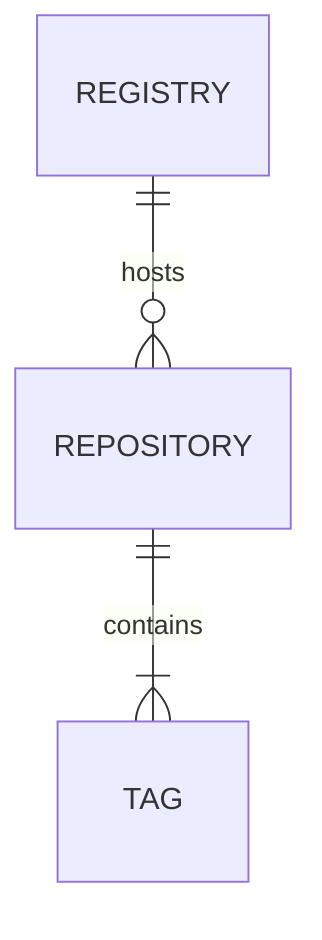



## INTRO

El objetivo de este post es ahondar mas en los conceptos alrededor de una imagen, como crear una imagen, como publicar una imagen y las buenas practicas para mantener una imagen.

Como describimos en la Parte 1. Una imagen es una colección ordenada de cambios en el sistema de archivos raíz y los parámetros de ejecución correspondientes para usar dentro de un tiempo de ejecución de contenedor. Una imagen normalmente la concatenación de sistemas de archivos en capas apilados uno encima del otro. [ver](https://docs.docker.com/glossary/#container-image).

## REGISTRY | REPOSITORY  | TAG

Tres conceptos necesarios para publicar imágenes



Registry / registro : servicio que contiene repositorios de imágenes e implementa [Docker Registry API]([HTTP API V2 | Docker Documentation](https://docs.docker.com/registry/spec/api/)). Se puede acceder al registro predeterminado usando un navegador en [Docker Hub](https://hub.docker.com/) o usando el comando  `docker search`.

Repository / repositorio:  es un conjunto de imágenes de Docker. Un repositorio se puede compartir publicandolo (`docker push`) a un Registry. Las diferentes imágenes del repositorio se pueden etiquetar mediante `tags`.

Tags / etiqueta: Es un alias mutable (que se puede cambiar) que se aplica a una imagen de Docker en un repositorio. Es la forma en la cual se identifican las distintas imágenes dentro de un repositorio. **NO PUEDE HABER DOS IMAGENES CON EL MISMO TAG EN UN MISMO REPOSITORIO. EL TAG de MUEVE DE UNA IMAGEN A OTRA COMO EN ESTE ANIMACION**


No hay un método de etiquetado impuesto, es bastante flexible. Bien utilizada puede simplifica mucho el despliegue y mal utilizada te puede dar muchos dolores de cabeza.  

Con este comando etiquetamos la imagen anterior del ejemplo anterior en el repositorio `demo` tag `1.0`. En que registro? en nuestra maquina local, al menos hasta que se publique.

```bash
docker tag 07c2a81dfe22 demo:1.0
```

Ejemplo , este comando obtiene la imagen del registro [quay.io](https://quay.io) repositorio `pqsdev/mssql-tools` tag `master`.

```bash
docker pull quay.io/pqsdev/mssql-tools:master
```

## :latest , una pesadilla oculta

- **CUANDO SE ESPECIFICA REPOSITORIO Y NO SE ESPCIFICA UN TAG QUEDA COMO :latest**

- **NO ES BUENA IDEA CONSUMIR IMAGENS DE TERCEROS CON LA ETIQUETA LATEST, POR QUE SE PUEDE ACTUALIZAR LA VERSION SIN QUE LO SEPAMOS**

## Empaquetar aplicación | Dockerfile

Para empaquetar una aplicación necesitamos crear un `Dockerfile` que contiene las instrucciones para crear una imagen. Dichas instrucciones estan documentadas en [Dockerfile reference | Docker Documentation](https://docs.docker.com/engine/reference/builder/)).

| Comando                                               | Descripción                                                                                                                                                                                                                                                                                                                                                                                                                                                                                                                                                                                                                                        |
| ----------------------------------------------------- | -------------------------------------------------------------------------------------------------------------------------------------------------------------------------------------------------------------------------------------------------------------------------------------------------------------------------------------------------------------------------------------------------------------------------------------------------------------------------------------------------------------------------------------------------------------------------------------------------------------------------------------------------- |
| `FROM [--platform=<platform>] <image> [AS <name>]`    | Imagen base para la compilación, puede ser un SO (`FROM debian`) o un  SO + alguna plataforma (`FROM node:19`). Debe ser la primera instrucción NO COMENTADA del Dockerfile                                                                                                                                                                                                                                                                                                                                                                                                                                                                        |
| `MANTAINER [email]`                                   | Persona que mantiene la imagen (OPCIONAL)                                                                                                                                                                                                                                                                                                                                                                                                                                                                                                                                                                                                          |
| `COPY <src>... <dest>`                                | Copia desde el contexto o contenedor intermedio al contenedor actual **(SE PREFIERE COPY ANTES QUE ADD POR SU SIMPLICIDAD)**                                                                                                                                                                                                                                                                                                                                                                                                                                                                                                                       |
| `ADD <src> ... <dest>`                                | Agrega archivos desde la fuente `src` al sistema de archivos de la imagen en el path indicado `dest`. A diferencia de copy `src` puede ser una URL o un archivo  `.tar` que se atuo extrae (1)                                                                                                                                                                                                                                                                                                                                                                                                                                                     |
| `WORKDIR`                                             |                                                                                                                                                                                                                                                                                                                                                                                                                                                                                                                                                                                                                                                    |
| `RUN`                                                 |                                                                                                                                                                                                                                                                                                                                                                                                                                                                                                                                                                                                                                                    |
| `CMD ["<executable>","<param1>","<param2>"]`          | - Proporcionar valores predeterminados para un contenedor en ejecución. Estos valores predeterminados pueden incluir un ejecutable o pueden omitir el ejecutable, en cuyo caso también debe especificar una instrucción `ENTRYPOINT`.<br />- Solo puede haber una instrucción CMD en un Dockerfile. Si incluye más de uno solo tendrá efecto el último .<br />-Si se usa CMD para proporcionar argumentos predeterminados para la instrucción ENTRYPOINT, las instrucciones CMD y ENTRYPOINT deben especificarse con el formato de array JSON. <br />-Si el usuario proporciona argumentos en `docker run` estos sobrescriben los valores de `CMD` |
| `ENTRYPOINT ["<executable>", "<param1>", "<param2>"]` | Le permite configurar un contenedor que se ejecutará como un ejecutable.<br/>Los argumentos de `docker run` serán concatenados después de este valor <br/> Solo puede ser la ultima instrucción no comentada dentro de Dockerfile                                                                                                                                                                                                                                                                                                                                                                                                                  |
| `EXPOSE <port> [<port> ...]`                          | - Le informa a Docker que el contenedor escuchara uno o varios puertos específicos<br/>- Esta instrucción no hace disponibles los puestos en el host, esto se hace con el argumento `-p`de `docker run`                                                                                                                                                                                                                                                                                                                                                                                                                                            |
| `ENV <key> <value>`                                   |                                                                                                                                                                                                                                                                                                                                                                                                                                                                                                                                                                                                                                                    |
| `VOL`                                                 |                                                                                                                                                                                                                                                                                                                                                                                                                                                                                                                                                                                                                                                    |

1 - [Best practices for writing Dockerfiles | Docker Documentation](https://docs.docker.com/develop/develop-images/dockerfile_best-practices/#add-or-copy)

## Ejemplo: Agregando software a una imagen base

Para entender mejor este concepto veamos como se construye una imagen de Docker. En este ejemplo estamos agregando ssh y vim a una imagen debian base

```dockerfile
# IMAGEN BASE QUE SE IMPORTA DESDE HUB.DOCKER.COM
FROM debian
# INSTALAMOS MAS APLICACIONES QUE MODIFICAN EL SISTEMA DE ARCHIVOS DE LA IMAGEN BASE
RUN apt-get update
RUN apt-get -y install ssh vim

# COPIAMOS LOS ARHICVOS DE NUESTRA APLICACION DENTRO DE LA IMAGEN
COPY ./app /app
```

Al ejecutar `docker build` vemos algo como esto

```
Step 1/4 : FROM debian
 ---> 4eacea30377a
Step 2/4 : RUN apt-get update
 ---> Running in d7ce4900aac4
Get:1 http://security.debian.org/debian-security bullseye-security InRelease [44.1 kB]
Get:2 http://deb.debian.org/debian bullseye InRelease [116 kB]
Get:3 http://deb.debian.org/debian bullseye-updates InRelease [39.4 kB]
...
Removing intermediate container d7ce4900aac4
 ---> 0c0e546002e0
Step 3/4 : RUN apt-get -y install ssh vim
 ---> Running in 5c3129e0f01a
Reading package lists...
Building dependency tree...
Reading state information...
...
Processing triggers for libc-bin (2.31-13+deb11u3) ...
Removing intermediate container 5c3129e0f01a
 ---> b17789eaaf7b
Step 4/4 : COPY ./app /app
 ---> 07c2a81dfe22
Successfully built 07c2a81dfe22
Successfully tagged demo:latest
```

Son 4 pasos , cada paso genera una nueva "CAPA" que altera el sistema de archivos anterior

| PASO | COMANDO                          | DIGEST RESULTANTE |     |
| ---- | -------------------------------- | ----------------- | --- |
| 1    | `FROM debian`                    | 4eacea30377a      |     |
| 2    | `RUN apt-get update`             | 0c0e546002e0      |     |
| 3    | `RUN apt-get -y install ssh vim` | b17789eaaf7b      |     |
| 4    | `COPY ./app /app 07c2a81dfe22`   | 07c2a81dfe22      |     |

Ese ultimo digest es el Image ID. el identificador único de la imagen.

## Ejemplo:  Compilar aplicación

Generalmente las aplicaciones requieren de un proceso de compilación para generar los artifacts (archivos resultantes de la compilación) a empaquetar. Esto se logra con un [*Multi-stage build*](https://docs.docker.com/build/building/multi-stage/)

## Publicar aplicación
