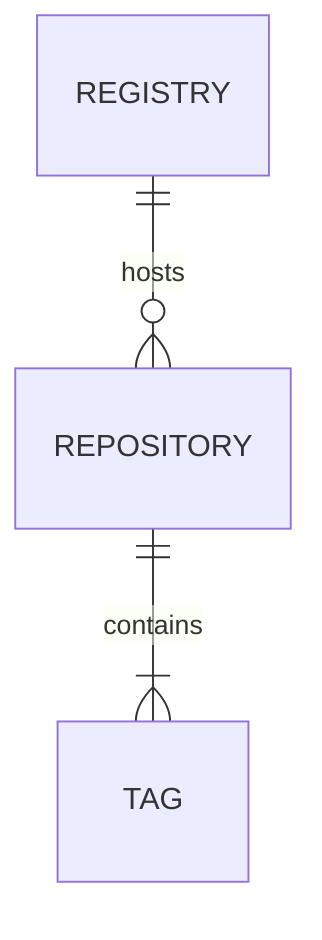
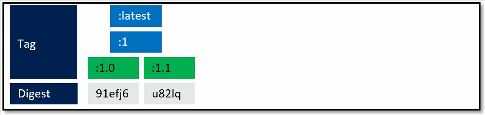
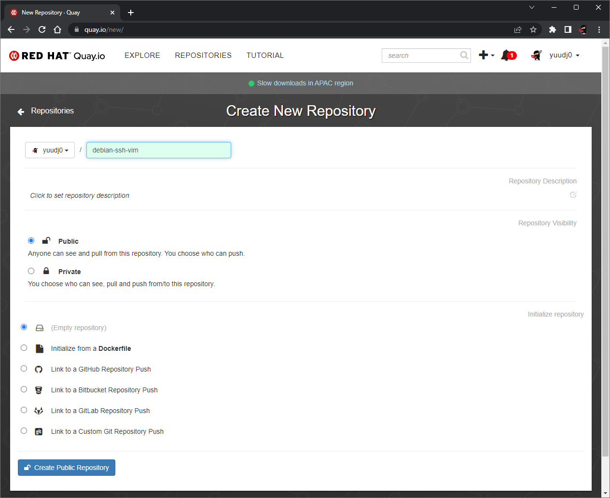
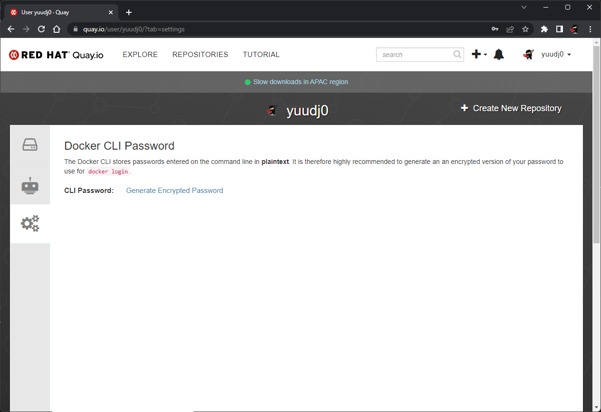
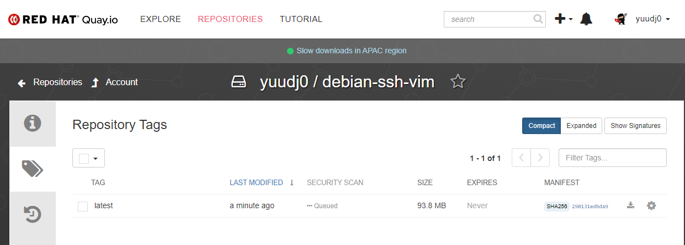

Este posts es parte de una serie. El objetivo de este post en particulaes es ahondar en los conceptos alrededor de una imagen, como crear una imagen y como publicar una imagen.



## Conceptos

Una imagen es una colección ordenada de cambios en el sistema de archivos raíz y los parámetros de ejecución correspondientes para usar dentro de un tiempo de ejecución de contenedor. Una imagen normalmente la concatenación de sistemas de archivos en capas apilados uno encima del otro. [ver](https://docs.docker.com/glossary/#container-image).

Hay tres conceptos adicionales que se deben tener en cuenta al momento de publicar imagenes



**Registry / registro :** Es **UN SERVICIO**  que ALMACENA uno o varios repositorios de imágenes e implementa [HTTP API V2 | Docker Documentation](https://docs.docker.com/registry/spec/api/). Se puede acceder al registro predeterminado usando un navegador en [Docker Hub](https://hub.docker.com/) o usando el comando  `docker search`. Como el la API del docker registry es abiesta hay OTROS repositorios públicos como quay.io.

**Repository / repositorio**:  es un conjunto de versiones de una misma imagen de Docker. O de imagenes de docker con un mismo nombre. Ejemplo [Docker NGINX](https://hub.docker.com/_/nginx/tags) es un repositorio en https://hub.docker.com/ que almacena todas las versiones de NGINX.

**Nombre**: Todas las imágenes deben tener un nombre. Se debe especificar al momento de compilar, si la imagen ha de ser publicada el nombre debe coincidir con la URL del repositorio. Si

**Digest**: Identificador único  generado automáticamente al momento de crear la imagen y es INMUTABLE (no puede cambiar). Se puede hacer referencia al digest de una imagen usando el digest.

```bash
# keycloak-x 15.0.2
docker pull quay.io/keycloak/keycloak-x@sha256:a6b7be1808b8443dde696c5f108be1cb6e7641d6b281ef7598df012c1d6871f8
```

**Tags / Etiqueta**: Es un alias mutable (que se puede cambiar) que se aplica a una imagen de Docker en un repositorio. Es la forma en la cual se identifican las distintas imágenes dentro de un repositorio.

```bash
# obtiene la imagen del registro https://quay.io, repositorio `pqsdev/mssql-tools`, tag `master`.
docker pull quay.io/pqsdev/mssql-tools:master
```

**NO PUEDE HABER DOS IMAGENES CON EL MISMO TAG EN UN MISMO REPOSITORIO. EL TAG de MUEVE DE UNA IMAGEN A OTRA COMO EN ESTE ANIMACION**



No hay un método de etiquetado impuesto, es bastante flexible. Bien utilizada puede simplifica mucho el despliegue y mal utilizada te puede dar muchos dolores de cabeza.

Con este comando etiquetamos la imagen anterior del ejemplo anterior en el repositorio `demo` tag `1.0`. En que registro? en nuestra maquina local, al menos hasta que se publique.

```bash
docker tag 07c2a81dfe22 demo:1.0
```

## `:latest` , una pesadilla oculta

- **CUANDO SE ESPECIFICA REPOSITORIO Y NO SE ESPCIFICA UN TAG QUEDA COMO :latest**

- **NO ES BUENA IDEA CONSUMIR IMAGENS DE TERCEROS CON LA ETIQUETA LATEST, POR QUE SE PUEDE ACTUALIZAR LA VERSION SIN QUE LO SEPAMOS**

## Empaquetar aplicación | Dockerfile

Para empaquetar una aplicación necesitamos crear un `Dockerfile` que contiene las instrucciones para crear una imagen. Dichas instrucciones estan documentadas en [Dockerfile reference | Docker Documentation](https://docs.docker.com/engine/reference/builder/)).

| Comando                                               | Descripción                                                                                                                                                                                                                                                                                                                                                                                                                                                                                                                                                                                                                                        |
| ----------------------------------------------------- | -------------------------------------------------------------------------------------------------------------------------------------------------------------------------------------------------------------------------------------------------------------------------------------------------------------------------------------------------------------------------------------------------------------------------------------------------------------------------------------------------------------------------------------------------------------------------------------------------------------------------------------------------- |
| `FROM <image>[:<tag> \| @digest]`                     | Imagen base para la compilación, puede ser un SO (`FROM debian`) o un  SO + alguna plataforma (`FROM node:19`).<br/>-Debe ser la primera instrucción NO COMENTADA del Dockerfile.<br/>-Puede aparecer muchas veces en un mismo Dockerfile. Por ejemplo en un multi-sage build<br/>-El `tag` o `@digest` son opcionales, si se omiten se asume el tag `latest`                                                                                                                                                                                                                                                                                      |
| `MANTAINER [email]`                                   | Persona que mantiene la imagen (OPCIONAL)                                                                                                                                                                                                                                                                                                                                                                                                                                                                                                                                                                                                          |
| `COPY <src>... <dest>`                                | - Agrega archivos/directorios desde la fuente `src` al sistema de archivos de la imagen en el path indicado `dest`.<br/>- Los archivos o directorio de `src`  deben ser relativo al directorio del CONTEXTO del build<br/>- `src`puede contener comodines utilizando la funcion de GO [filepath.Match](https://pkg.go.dev/path/filepath#Match) <br/>- `dest` es un path absoluto o un path relativo a `WORKDIR`<br/>- Si `dest` no existe, se crea junto con todos los directorios faltantes en el path<br/>**(SE PREFIERE COPY ANTES QUE ADD POR SU SIMPLICIDAD)**                                                                                |
| `ADD <src> ... <dest>`                                | - Agrega archivos/directorios desde la fuente `src` al sistema de archivos de la imagen en el path indicado `dest`.<br/>- `src` puede ser una URL o un archivo  `.tar` que se extrae automáticamente (1)<br/>- si `src` es un archivo o directorio debe ser relativo al directorio del CONTEXTO del build<br/>- `src`puede contener comodines utilizando la funcion de GO [filepath.Match](https://pkg.go.dev/path/filepath#Match) <br/>- `dest` es un path absoluto o un path relativo a `WORKDIR`<br/>- Si `dest` no existe, se crea junto con todos los directorios faltantes en el path                                                        |
| `WORKDIR`                                             | Directorio de trabajo actual del contenedor                                                                                                                                                                                                                                                                                                                                                                                                                                                                                                                                                                                                        |
| `RUN`                                                 | Ejecuta un comando shell `/bin/sh -c`                                                                                                                                                                                                                                                                                                                                                                                                                                                                                                                                                                                                              |
| `CMD ["<executable>","<param1>","<param2>"]`          | - Proporcionar valores predeterminados para un contenedor en ejecución. Estos valores predeterminados pueden incluir un ejecutable o pueden omitir el ejecutable, en cuyo caso también debe especificar una instrucción `ENTRYPOINT`.<br />- Solo puede haber una instrucción CMD en un Dockerfile. Si incluye más de uno solo tendrá efecto el último .<br />-Si se usa CMD para proporcionar argumentos predeterminados para la instrucción ENTRYPOINT, las instrucciones CMD y ENTRYPOINT deben especificarse con el formato de array JSON. <br />-Si el usuario proporciona argumentos en `docker run` estos sobrescriben los valores de `CMD` |
| `ENTRYPOINT ["<executable>", "<param1>", "<param2>"]` | Le permite configurar un contenedor que se ejecutará como un ejecutable.<br/>Los argumentos de `docker run` serán concatenados después de este valor <br/> Solo puede ser la ultima instrucción no comentada dentro de Dockerfile                                                                                                                                                                                                                                                                                                                                                                                                                  |
| `EXPOSE <port> [<port> ...]`                          | - Le informa a Docker que el contenedor escuchara uno o varios puertos específicos<br/>- Esta instrucción no hace disponibles los puestos en el host, esto se hace con el argumento `-p`de `docker run`                                                                                                                                                                                                                                                                                                                                                                                                                                            |
| `ENV <key> <value>`                                   | - Asigna el valor a una variable de entorno `ENV ENV_VAR_1 = SOMETHING`  <br/>- El valor será valido para todas las IMAGENES DERIVADAS de esta imagen<br />- El valor será valido para todas los contenedores de esta imagen a no ser que sean sobrescritos utilizando el argumento `-e` de `docker run`                                                                                                                                                                                                                                                                                                                                           |
| `VOLUME ["<path>", ...]`                              | Crea un punto de montaje con un nombre especifico para poder ser mapeado con directorios externos                                                                                                                                                                                                                                                                                                                                                                                                                                                                                                                                                  |

## Ejemplo: Agregando software a una imagen base

Para entender mejor este concepto veamos como se construye una imagen de Docker. En este ejemplo estamos agregando ssh y vim a una imagen debian base

```dockerfile
# IMAGEN BASE QUE SE IMPORTA DESDE HUB.DOCKER.COM
FROM debian
# INSTALAMOS MAS APLICACIONES QUE MODIFICAN EL SISTEMA DE ARCHIVOS DE LA IMAGEN BASE
RUN apt-get update
RUN apt-get -y install ssh vim

# COPIAMOS LOS ARHICVOS DE NUESTRA APLICACION DENTRO DE LA IMAGEN
COPY ./app /app
```

Al ejecutar `docker build` vemos algo como esto

```
Step 1/4 : FROM debian
 ---> 4eacea30377a
Step 2/4 : RUN apt-get update
 ---> Running in d7ce4900aac4
Get:1 http://security.debian.org/debian-security bullseye-security InRelease [44.1 kB]
Get:2 http://deb.debian.org/debian bullseye InRelease [116 kB]
Get:3 http://deb.debian.org/debian bullseye-updates InRelease [39.4 kB]
...
Removing intermediate container d7ce4900aac4
 ---> 0c0e546002e0
Step 3/4 : RUN apt-get -y install ssh vim
 ---> Running in 5c3129e0f01a
Reading package lists...
Building dependency tree...
Reading state information...
...
Processing triggers for libc-bin (2.31-13+deb11u3) ...
Removing intermediate container 5c3129e0f01a
 ---> b17789eaaf7b
Step 4/4 : COPY ./app /app
 ---> 07c2a81dfe22
Successfully built 07c2a81dfe22
Successfully tagged demo:latest
```

Son 4 pasos , cada paso genera una nueva "CAPA" que altera el sistema de archivos anterior

| PASO | COMANDO                          | DIGEST RESULTANTE |     |
| ---- | -------------------------------- | ----------------- | --- |
| 1    | `FROM debian`                    | 4eacea30377a      |     |
| 2    | `RUN apt-get update`             | 0c0e546002e0      |     |
| 3    | `RUN apt-get -y install ssh vim` | b17789eaaf7b      |     |
| 4    | `COPY ./app /app 07c2a81dfe22`   | 07c2a81dfe22      |     |

Ese ultimo digest es el Image ID. el identificador único de la imagen.

## Publicar una imagen

Para publicar una imagen

- Contar con una cuenta en un Docker Registry publico o privado

- Crear un repositorio nuevo en el Docker Registry.

- Compilar la imagen con EL MISMO NOMBRE QUE EL REGISTRY e indicarle los tags

- Hacer un PUSH de la imagen

En [quay.io](https://quay.io) pueden crear un usuario nuevo utilizando las credenciales de [GitHub.com](https://github.com). Esto tiene una ventaja por que depsues se puede hacer integracion continua desde sus repos de GitHub :D.

Una vez autenticados deben crear un Registry para la imagen.


> UN REGISTRY POR COMPONENTE DE SOFTWARE. NO HAGAN `imagen:frontend` e `imagen:backend` esos son dos repositorios separados
{: .prompt-danger }

{: w="800"}

- Se especifica el nombre del repositorio (que tiene como prefijo `<<usuario_quay>>/`)

- El repositorio es publico, si quieren uno privado hay que pagar

- Origen del Docker File, en este caso optaremos por la opcion `Empty repository`para luego hacer un push de la imagen compilada localmente.

Si generaron el usuario de Quay con GitHub van a tener uqe generar un password encriptado para `docker login`. En el margen superior derecho hagan click en su nombre de usuario y `Account Settings`.  Lugo `Generate Encrypted Password`



Creamos un Dockerfile , parecido al ejemplo anterior pero sin la copia de archivo

```dockerfile
# IMAGEN BASE QUE SE IMPORTA DESDE HUB.DOCKER.COM
FROM debian
# INSTALAMOS MAS APLICACIONES QUE MODIFICAN EL SISTEMA DE ARCHIVOS DE LA IMAGEN BASE
RUN apt-get update
RUN apt-get -y install ssh vim
```

Compilamos el Dockerfile con el nombre del repositorio, en mi caso

```bash
docker build -t quay.io/yuudj0/debian-ssh-vim .
```

Luego debemos autenticarnos en Quay.io utilizando

```bash
$ docker login quay.io
Username: Tu usuario
Password: TuPasswordSuperSecreto
Login Succeeded
```

Finalmente hacemos un push de la imagen

```bash
$ docker push quay.io/yuudj0/debian-ssh-vim
Using default tag: latest
The push refers to repository [quay.io/yuudj0/debian-ssh-vim]
e14ddc80a03e: Pushed
06a7d063e98a: Pushed
a9099c3159f5: Pushed
latest: digest: sha256:290131edbda99256ff6f0672d11b816de08691747c4719a3298923f11b25ee09 size: 953
```



Como no le agregamos tags a la imagen automaticamente quedo con el tag `latest`. Podemos cambiar esto si

- Al compilar la imagen especificamos un tag

- Agregamos un tag y luego hacemos el push utilizando el tag

La ultima opcion seria algo asi

```bash
# agregamos el tag :v1.0 a la imagen quay.io/yuudj0/debian-ssh-vim:latest
docker tag quay.io/yuudj0/debian-ssh-vim:latest quay.io/yuudj0/debian-ssh-vim:v1.0
docker push quay.io/yuudj0/debian-ssh-vim:v1.0
The push refers to repository [quay.io/yuudj0/debian-ssh-vim]
e14ddc80a03e: Layer already exists
06a7d063e98a: Layer already exists
a9099c3159f5: Layer already exists
v1.0: digest: sha256:290131edbda99256ff6f0672d11b816de08691747c4719a3298923f11b25ee09 size: 953
```


En este caso los digest coinciden por que la imagen es la misma, es decir que `latest=v1.0`

## Footnotes

1) Best practices for writing Dockerfiles | Docker Documentation]([Best practices for writing Dockerfiles | Docker Documentation](https://docs.docker.com/develop/develop-images/dockerfile_best-practices/))
2) [Repositorio de ejemplo creado](https://quay.io/repository/yuudj0/debian-ssh-vim)
